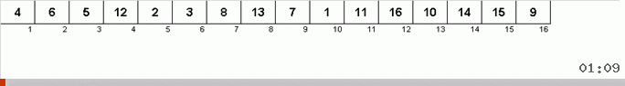
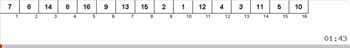
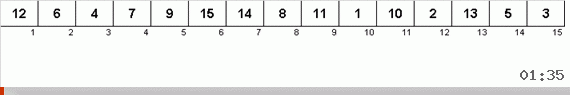

# Algorithms on TS
### Straight insertion
```


The worst time: O(n^2) comparisons, exchanges 
The best time: O(n) comparisons, O(1) exchanges 
Average time: O(n^2) comparisons, exchanges

Memory costs: O(n) total, O(1) supportive
```
### Binary insertion
```


The worst time: O(nlogn) comparisons, O(n^2) exchanges 
The best time: O(nlogn) comparisons, O(1) exchanges 
Average time: O(nlogn) comparisons, O(n^2) exchanges

Memory costs: O(n) total, O(1) supportive
```
### Straight selection
```


The worst time: O(n^2) comparisons, exchanges 
The best time: O(n^2) comparisons, O(n) exchanges 
Average time: O(n^2) comparisons, O(nlogn) exchanges

Memory costs: O(n) total, O(1) supportive
```
### Bubble sort
```


The worst time: O(n^2) comparisons, exchanges 
The best time: O(n) comparisons, O(1) exchanges 
Average time: O(n^2) comparisons, O(n^2) exchanges

Memory costs: O(n) total, O(1) supportive
```